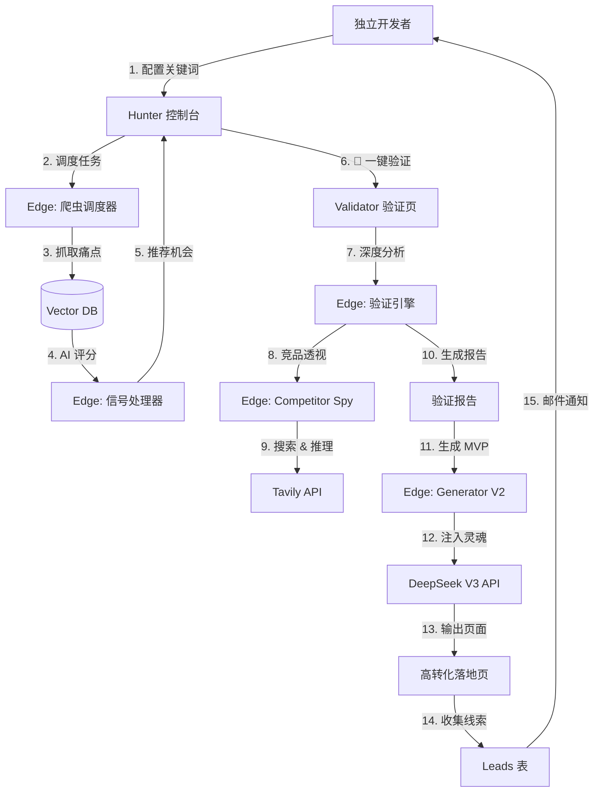

# 🧭 Project Journal: Solo Founder OS 之路

> **最后更新**: 2026-01-27
> **当前版本**: Phase 10 Complete (Core Deep Dive Finished)

本文档记录了项目从简单的 "MVP Validator" 进化为完整的 "Solo Founder OS" 的架构演变与核心概念。

## 1. 核心概念词典 (The Vocabulary)

我们在开发过程中定义了一套全新的"创业黑话"，构成了系统的骨架：

| 概念 (Term) | 代号 | 定义 | 核心价值 |
| :--- | :--- | :--- | :--- |
| **Hunter** | 狩猎雷达 | **主动发现系统**。 全网扫描 Reddit/小红书，寻找高频出现的痛点。 | 帮你回答 *"我不道做什么"* 的问题。 |
| **Validator** | 验证器 | **被动分析系统**。 对一个具体的 Idea 进行全方位体检（市场、竞品、搜索量）。 | 帮你回答 *"这个 Idea 靠谱吗"* 的问题。 |
| **Bridge** | 智能桥梁 | **连接层**。 连接 Hunter 和 Validator 的通道。实现 "看到好机会 -> 一键验证" 的丝滑流转。 | 消除手动复制粘贴的摩擦，极速验证。 |
| **Generator** | 造物主 | **执行系统**。 根据验证报告，一键生成高转化率的 MVP 落地页 (Landing Page)。 | 帮你回答 *"怎么低成本上线"* 的问题。 |
| **Real AI Brain** | 真实大脑 | **智能核心**。 接入 DeepSeek V3，让系统不再生成 Mock 数据，而是有逻辑、有情感的真实文案。 | **注入灵魂**，让生成的页面真正能卖货。 |
| **Competitor Spy** | 竞品透视 | **情报系统**。 利用搜索+AI，不触犯反爬规则地推断出竞品的定价策略和商业模式。 | 知己知彼，制定差异化定价。 |

---

## 2. 最终架构图 (The Architecture)

系统已形成完整的闭环：**发现 -> 验证 -> 落地 -> 变现**。

## 3. 技术里程碑 (Milestones)

- **Phase 1-5**: 基础验证器搭建 (Validator + Report UI)。
- **Phase 6**: MVP Generator V1 (Mock 数据)。
- **Phase 7**: Hunter 后端 (Vector DB + Crawler)。
- **Phase 8**: Hunter 前端 (仪表盘)。
- **Phase 9**: Bridge (一键验证流)。
- **Phase 10**: Real AI + Spy (DeepSeek 接入，完整商业闭环)。

## 4. 下一步 (Next Steps)

系统内核已极其强大。接下来的重点将转向 **外部增长 (Phase 11 - Traffic)**：

- SEO 自动化
- 社交分享卡片 (OG Image)
- 邮件营销 (Email Drip)
